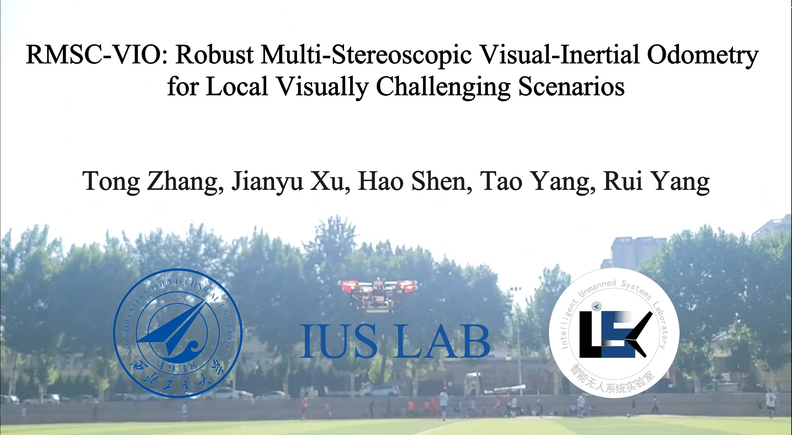
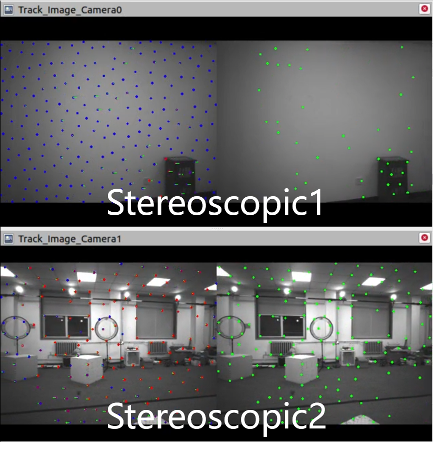
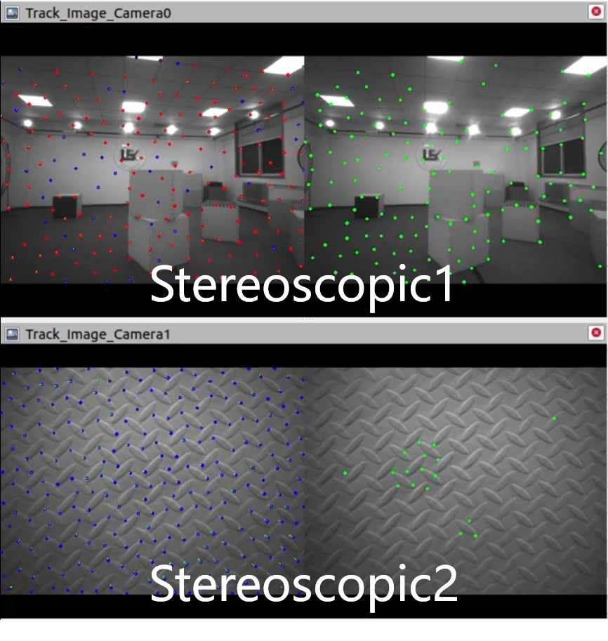
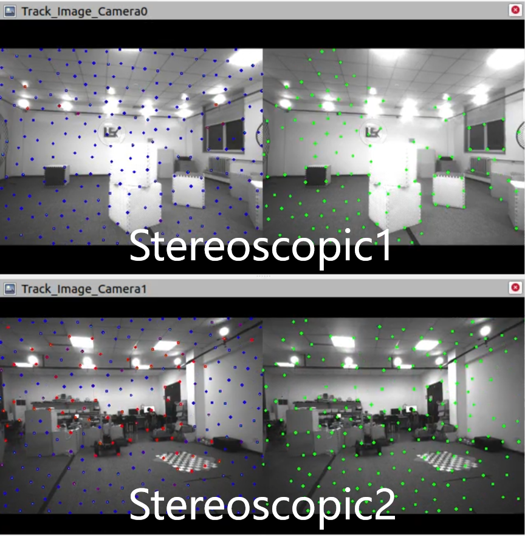
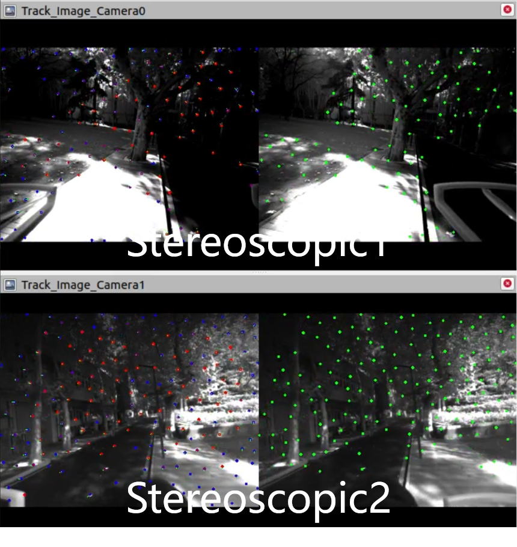
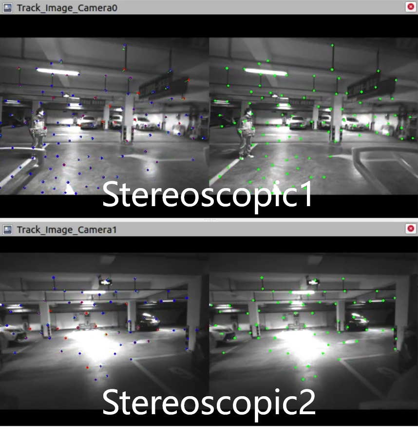
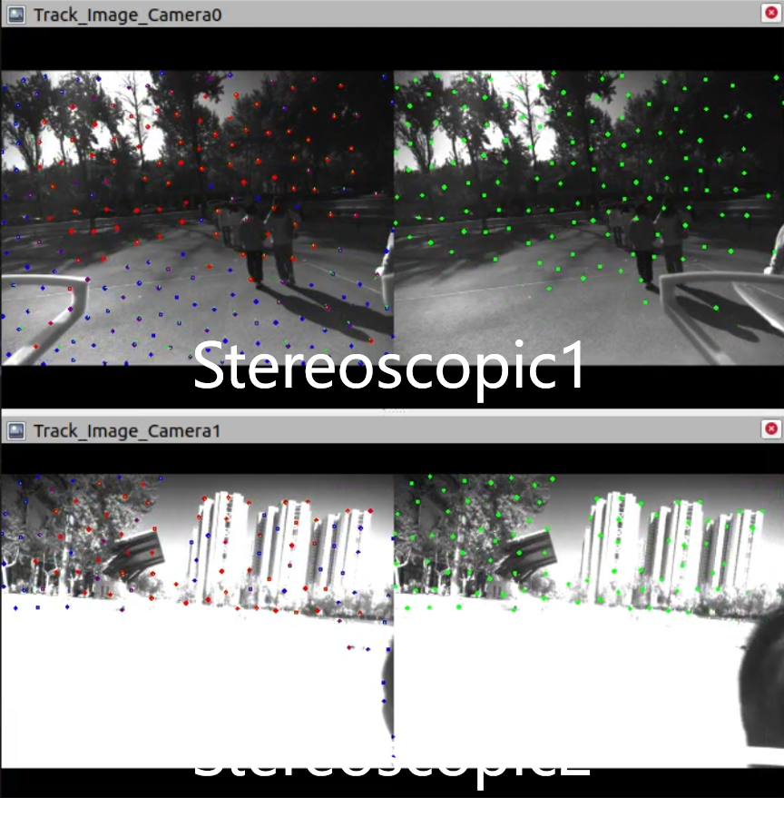
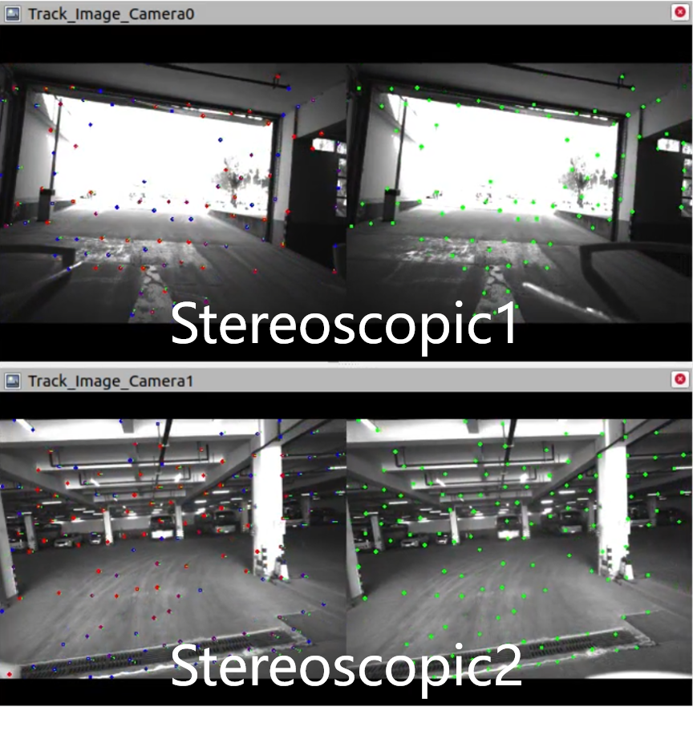
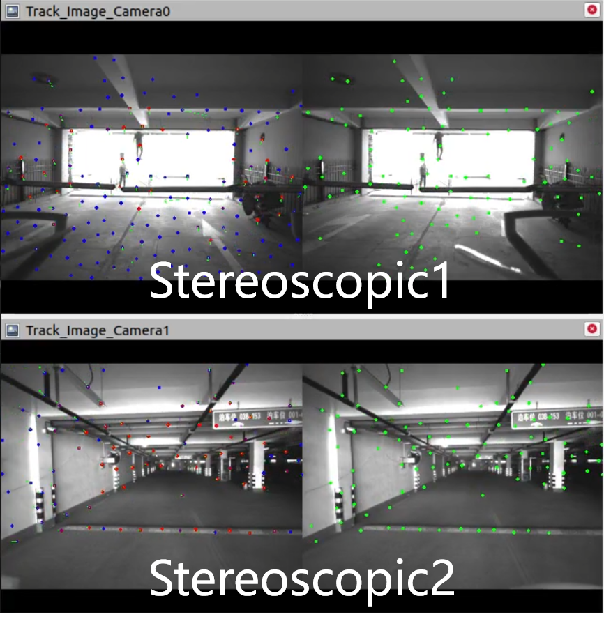

# RMSC-VIO

### RMSC-VIO: Robust Multi-Stereoscopic Visual-Inertial Odometry for Local Visually Challenging Scenarios

* **T. Zhang, J. Xu, H. Shen, R. Yang and T. Yang, "RMSC-VIO: Robust Multi-Stereoscopic Visual-Inertial Odometry for Local Visually Challenging Scenarios," in IEEE Robotics and Automation Letters, doi: 10.1109/LRA.2024.3377008.**[pdf](https://ieeexplore.ieee.org/document/10472018)

      @ARTICLE{10472018,
        author={Zhang, Tong and Xu, Jianyu and Shen, Hao and Yang, Rui and Yang, Tao},
        journal={IEEE Robotics and Automation Letters}, 
        title={RMSC-VIO: Robust Multi-Stereoscopic Visual-Inertial Odometry for Local Visually Challenging Scenarios}, 
        year={2024},
        volume={9},
        number={5},
        pages={4130-4137},
        doi={10.1109/LRA.2024.3377008}}

Click for the video demo.
[](https://youtu.be/_CWLo0V31og)

## 1. Datasets

    

We collected seven sequences, comprising three indoor and four outdoor scenes. These sequences included challenging visual scenarios. such as featureless environments, frequent occlusions, abrupt lighting changes, overexposure, dynamic objects, and large-scale scenes.
For indoor sequences, we utilized a motion capture system to acquire ground truth poses with millimeter-level accuracy. For outdoor sequences, Real-Time Kinematic (RTK) technology was employed to obtain ground truth trajectories with centimeter-level precision.

### 1.1 [Indoor_topic]

    Stereoscopic1: /camera1/infra1/image_rect_raw 15Hz, /camera1/infra2/image_rect_raw 15Hz

    Stereoscopic2: /camera2/infra1/image_rect_raw 15Hz, /camera2/infra2/image_rect_raw 15Hz

    imu: /mavros/imu/data_raw 200Hz

    ground truth: /odometry 100Hz
    
### 1.2 [Outdoor_topic]

    Stereoscopic1: /camera1/infra1/image_rect_raw 15Hz, /camera1/infra2/image_rect_raw 15Hz

    Stereoscopic2: /camera2/infra1/image_rect_raw 15Hz, /camera2/infra2/image_rect_raw 15Hz

    imu: /mavros/imu/data_raw 200Hz

    ground truth: /mavros/global_position/raw/fix 10Hz

[RMSC-VIO Datasets](https://pan.baidu.com/s/1vOmaT4yJX6tf_EHAj20-Dw?pwd=RMSC).

## 2. Prerequisites
### 2.1 **Ubuntu** and **ROS**
Ubuntu 64-bit 18.04 or 20.04.
ROS  Melodic or noetic. [ROS Installation](http://wiki.ros.org/ROS/Installation)

### 2.2. **Ceres Solver**
Follow [Ceres Installation](http://ceres-solver.org/installation.html).

### 2.3 ##Realsense##
Follow ##Double_Camera##

## 3. Build RMSC-VIO
Clone the repository and catkin_make:
```
    cd ~/catkin_ws/src
    git clone https://github.com/npu-ius-lab/RMSC-VIO.git
    cd ../
    catkin_make
    source ~/catkin_ws/devel/setup.bash
```

## 4. Run Example
```
    roslaunch vins vins_rviz.launch
    rosrun vins vins_node src/RMSC-VIO/config/realsense_d435i/realsense_stereo_imu_config.yaml
```
